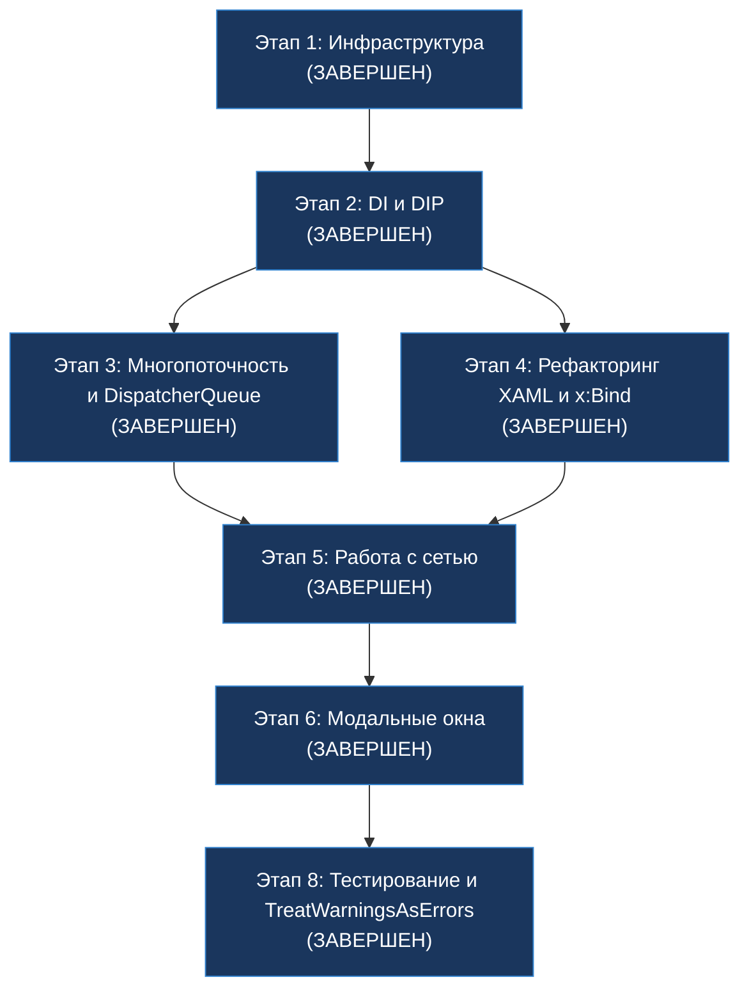

# План рефакторинга проекта K-Tools

## Контекст и цели

Данный план составлен на основе бескомпромиссного аудита кодовой базы десктопного приложения **K-Tools** (WinUI 3 / Windows App SDK / .NET 8). Аудит выявил системные нарушения архитектурных и кодстайл-правил, зафиксированных в `AGENTS.md` и `.github/instructions/`.

**Выявленные системные проблемы:**

| Категория | Суть проблемы | Масштаб |
|-----------|---------------|---------|
| Архитектура (DIP) | Статические синглтоны `.Instance` вместо DI | 50+ вхождений в 18+ файлах |
| Service Locator | `App.Services.GetRequiredService<T>()` для не-ViewModel сервисов в Code-Behind | 4 вхождения в 2 страницах |
| Потокобезопасность | `GetAwaiter().GetResult()` на UI-потоке | 1 критическое место (`VideoEncodingScript.cs:37`) |
| HttpClient | Ручное создание `new HttpClient()` | 2 файла (`DependencyManager`, `UpdateService`) |
| XAML-привязки | `{Binding}` вместо `{x:Bind}` | 6 мест в 2 файлах |
| Code-Behind | Бизнес-логика в контролах | `ScriptSettingsControl.xaml.cs` (66KB), `TrackSelectionControl.xaml.cs` (72KB) |
| Циклическая зависимость | `LogService` ↔ `SettingsManager` через `.Instance` | 2 класса Core-слоя |
| Качество кода | Нет анализаторов, нет `.editorconfig`, нет `TreatWarningsAsErrors` | Весь проект |
| Локализация | Захардкоженные строки UI, нет `.resw` | Весь проект |
| Доступность | Нет `AutomationProperties`, нет `TabIndex` | Все XAML-файлы |
| Тестирование | Нет тестового проекта и юнит-тестов | Весь проект |
| YAGNI | Неиспользуемый класс `SavedFileState` | 1 файл |

**Полный перечень синглтонов `.Instance`:**
1. `LogService.Instance`
2. `SettingsManager.Instance`
3. `DependencyManager.Instance`
4. `ScriptRegistry.Instance`
5. `FFmpegRunner.Instance`
6. `Eac3toRunner.Instance`
7. `MediaProbeService.Instance`
8. `MkvmergeRunner.Instance`

**Принцип Zero-Breakage:** каждый шаг спроектирован так, чтобы после его выполнения проект **гарантированно компилировался и запускался**. Порядок строго инкрементальный: сначала фундамент, затем сервисы, затем потребители.

---

## Этап 1: Инфраструктура и качество кода - ЗАВЕРШЕН

> **Цель:** Настроить инструменты статического анализа и единый код-стайл до начала любых изменений в логике, чтобы все последующие этапы автоматически проверялись анализаторами.

---

### Шаг 1.1 — Создание `.editorconfig` в корне решения - ЗАВЕРШЕН

**Действие:**
Создать файл `.editorconfig` в каталоге `F:\Programming\Utils\k-tools\` с правилами форматирования, отступов и именования в соответствии с Microsoft C# Coding Conventions.

**Файлы:**
- `[NEW]` `.editorconfig`

**Критерий приёмки:**
Файл `.editorconfig` существует в корне решения. Проект собирается без ошибок.

---

### Шаг 1.2 — Подключение Roslyn-анализаторов и StyleCop - ЗАВЕРШЕН

**Действие:**
Добавить в `KTools.App.csproj` NuGet-пакеты `Microsoft.CodeAnalysis.NetAnalyzers` и `StyleCop.Analyzers`. Создать базовый файл `stylecop.json` в каталоге `KTools.App/`.

**Файлы:**
- `[MODIFY]` `KTools.App/KTools.App.csproj`
- `[NEW]` `KTools.App/stylecop.json`

**Критерий приёмки:**
Пакеты установлены, `stylecop.json` присутствует. Проект собирается без ошибок (предупреждения допускаются).

---

### Шаг 1.3 — Подавление исторических предупреждений анализаторов - ЗАВЕРШЕН

**Действие:**
Добавить точечные `#pragma warning disable` с комментарием `// TODO: Рефакторинг — Этап N` для каждого файла с историческими предупреждениями, не связанными с текущим рефакторингом.

**Файлы:**
- `[MODIFY]` Затронутые файлы `.cs` (точечные `#pragma`)

**Критерий приёмки:**
Выполнить сборку — проект собирается без ошибок и без предупреждений (все подавлены осознанно).

---

### Шаг 1.4 — Удаление неиспользуемого кода (YAGNI) - ЗАВЕРШЕН

**Действие:**
Удалить файл `SavedFileState.cs`, который нигде не используется в проекте.

**Файлы:**
- `[DELETE]` `KTools.App/Core/SavedFileState.cs`

**Критерий приёмки:**
Файл удалён. Проект собирается без ошибок.

---

### 🔒 Контрольная точка Этапа 1 - ЗАВЕРШЕНА

```
dotnet build -c Debug -p:Platform=x64
```
**Ожидаемый результат:** 0 ошибок, 0 предупреждений. Анализаторы активны.

---

## Этап 2: Изоляция зависимостей и удаление Service Locator / Синглтонов

> **Цель:** Перевести проект на инверсию зависимостей (DIP) через конструкторное внедрение. Убрать все обращения к `.Instance` и отказаться от Service Locator в Code-Behind.

---

### Шаг 2.1 — Создание интерфейсов для Core-сервисов и Infrastructure - ЗАВЕРШЕН

**Действие:**
Создать интерфейсы в каталоге `Services/Contracts/` для всех ключевых менеджеров и раннеров: `ILogService`, `ISettingsManager`, `IDependencyManager`, `IPathManager`, `IScriptRegistry`, `IFFmpegRunner`, `IEac3toRunner`, `IMediaProbeService`, `IMkvmergeRunner`.

**Файлы:**
- `[NEW]` `KTools.App/Services/Contracts/*.cs`

**Критерий приёмки:**
Интерфейсы созданы с русскоязычной XML-документацией. Проект собирается без ошибок.

---

### Шаг 2.2 — Реализация интерфейсов в существующих классах и разрыв циклической зависимости - ЗАВЕРШЕН

**Действие:**
1. Объявить реализацию интерфейсов в заголовках существующих классов.
2. Разорвать циклическую связь `LogService ↔ SettingsManager` через выделение базовых путей в независимый сервис `IPathManager` (создан `PathManagerService` как обёртка над статическим `PathManager`).

**Файлы:**
- `[MODIFY]` Классы Core- и Infrastructure-слоёв (реализация интерфейсов)
- `[NEW]` `KTools.App/Core/PathManagerService.cs`

**Критерий приёмки:**
Классы реализуют соответствующие интерфейсы. Циклическая зависимость устранена. Проект собирается без ошибок.

---

### Шаг 2.3 — Внедрение DI и сервиса навигации (Отказ от Service Locator) - ЗАВЕРШЕН

**Действие:**
1. В `App.xaml.cs` в методе `ConfigureServices()` зарегистрировать все Core- и Infrastructure-сервисы, а также ViewModels и службы приложения.
2. Полностью убрать вызовы `App.Services.GetRequiredService<T>()` для бизнес-сервисов из Code-Behind страниц (единственным исключением является получение ViewModel страницы).
3. Создать `INavigationService` и реализацию `NavigationService`, инкапсулирующие работу с XAML-элементом `Frame` и использующие строковые ключи для маршрутизации, чтобы ViewModels не зависели от слоёв представления и типов XAML-страниц.

**Файлы:**
- `[MODIFY]` `KTools.App/App.xaml.cs` — регистрация сервисов в DI
- `[NEW]` `KTools.App/Services/Contracts/INavigationService.cs`
- `[NEW]` `KTools.App/Services/Implementations/NavigationService.cs`

**Критерий приёмки:**
Сервисы зарегистрированы в DI. Маршрутизация изолирована. Проект собирается и работает корректно.

---

### Шаг 2.4 — Нативная интеграция DI для страниц (перенос логики в ViewModels) - ЗАВЕРШЕН

**Действие:**
ViewModels получают зависимости через конструктор. Страницы получают ViewModel из DI-контейнера в конструкторах по умолчанию. Вся бизнес-логика перенесена из Code-Behind во ViewModels.

**Файлы:**
- `[MODIFY]` `KTools.App/UI/Pages/*.xaml.cs`
- `[MODIFY]` `KTools.App/ViewModels/*.cs`

**Критерий приёмки:**
Бизнес-логика перенесена во ViewModels. Code-Behind содержит только инициализацию UI и привязку DataContext.

---

### Шаг 2.5 — Перевод потребителей на конструкторное внедрение (замена `.Instance`) - ЗАВЕРШЕН

**Действие:**
Поочерёдно заменить все обращения к `.Instance` на внедрение через конструктор.

**Группа A — Infrastructure Runner'ы (нижний уровень) - ЗАВЕРШЕНА:**
- `FFmpegRunner.cs` — зависимости внедряются через конструктор.
- `Eac3toRunner.cs` — зависимости внедряются через конструктор.
- `MkvmergeRunner.cs`, `QaacRunner.cs`, `DeeRunner.cs` — переведены на DI.

**Группа B — Core-сервисы (средний уровень) - ЗАВЕРШЕНА:**
- `MediaProbeService.cs` — зависимости (`ILogService`, `IMkvmergeRunner`, `IFFmpegRunner`) в конструктор.
- `DependencyManager.cs` — зависимость (`ILogService`) в конструктор.
- `SettingsManager.cs` — зависимость (`ILogService`) в конструктор.
- `ScriptRegistry.cs` — зависимости (`IServiceProvider`, `ISettingsManager`, `ILogService`) в конструктор.

**Группа C — Scripts (средний уровень) - ЗАВЕРШЕНА:**
- `AbstractScript.cs` — предоставить `ILogService` и `ISettingsManager` как `protected` свойства, внедряемые через конструктор базового класса.
- Наследники `AbstractScript` (12 скриптов: `VideoEncodingScript`, `AudioChannelsScript` и др.) — передавать зависимости через `base(...)`.
- `ScriptRegistry.cs` — разрешать скрипты через `IServiceProvider` (зарегистрировать все скрипты как `Transient`).

**Группа D — Services (средний уровень) - ЗАВЕРШЕНА:**
- `UpdateService.cs`, `DialogService.cs`, `NavigationService.cs`, `NotificationService.cs` — перевести на конструкторное внедрение.

**Группа E — ViewModels (верхний уровень) - ЗАВЕРШЕНА:**
- `MainViewModel.cs`, `SettingsViewModel.cs`, `WorkPanelViewModel.cs`, `HomeViewModel.cs`, `DependencySetupViewModel.cs`, `LogViewModel.cs`, `SubtitlePreviewViewModel.cs` — перевести на конструкторное внедрение.

**Группа F — Window и оставшиеся (верхний уровень) - ЗАВЕРШЕНА:**
- `MainWindow.xaml.cs` — получить `ISettingsManager` и `ILogService` через конструктор/DI.
- `FFmpegOutputParser.cs` — внедрить `ILogService`.

**Файлы:**
- `[MODIFY]` Все перечисленные выше файлы Core-, Infrastructure-, Scripts-, ViewModels- и UI-слоёв.

**Критерий приёмки:**
All вызовы `.Instance` заменены на конструкторное внедрение. Проект успешно собирается.

---

### Шаг 2.6 — Удаление свойств `.Instance` и преобразование синглтонов ✅

**Действие:**
1. Удалить свойства `Instance` и статические `Lazy<T>` из всех 8 синглтон-классов.
2. Преобразовать статический `PathManager` в `sealed class PathManager : IPathManager` и удалить класс-обертку `PathManagerService`.
3. Убрать или скрыть статическое свойство `App.Services`.

**Файлы:**
- `[MODIFY]` `KTools.App/Core/LogService.cs`
- `[MODIFY]` `KTools.App/Core/SettingsManager.cs`
- `[MODIFY]` `KTools.App/Core/DependencyManager.cs`
- `[MODIFY]` `KTools.App/Core/PathManager.cs`
- `[DELETE]` `KTools.App/Core/PathManagerService.cs`
- `[MODIFY]` `KTools.App/Infrastructure/*Runner.cs`
- `[MODIFY]` `KTools.App/App.xaml.cs`

**Критерий приёмки:**
Ни один класс не содержит статических полей `Instance`. Сборка проходит без ошибок.

**Статус:** ✅ Завершён. Все свойства `.Instance` удалены из кодовой базы. Статические методы-утилиты переведены на явную передачу `ILogService` через параметры. Интерфейсы `ISettingsManager` и `IAssParser` расширены недостающими методами. Сборка проходит с 0 ошибками.

---

### 🔒 Контрольная точка Этапа 2 ✅

```
dotnet build -c Debug -p:Platform=x64
```
**Ожидаемый результат:** 0 ошибок. Полный переход на DI завершен, синглтоны удалены.
**Фактический результат:** ✅ 0 ошибок. Этап 2 полностью завершён.

---

## Этап 3: Многопоточность и потокобезопасность (DispatcherQueue)

> **Цель:** Исключить блокировки главного потока UI и предотвратить исключения `COMException` при обновлении UI-элементов из фоновых потоков (вызываемых консольными раннерами).

---

### Шаг 3.1 — Исключение блокировок и GetAwaiter().GetResult()

**Действие:**
1. Ввести строгое архитектурное правило: **Запрещено использование `.GetAwaiter().GetResult()` в главном потоке.**
2. Переписать свойство `IsNvencSupported` в `VideoEncodingScript.cs` (строка 37) на полностью асинхронный паттерн с использованием `async/await` и `Task.Run` для вычислений, не блокирующих рендеринг и диспетчеризацию сообщений ОС.
3. Организовать асинхронную инициализацию скрипта при его выборе в интерфейсе.

**Файлы:**
- `[MODIFY]` `KTools.App/Scripts/VideoEncodingScript.cs`
- `[MODIFY]` `KTools.App/ViewModels/WorkPanelViewModel.cs`

**Критерий приёмки:**
Код не содержит блокирующих ожиданий `.GetAwaiter().GetResult()` на UI-потоке. Проверка NVENC проходит асинхронно без фризов интерфейса.

---

### Шаг 3.2 — Разработка ThreadSafeViewModel и защита от COMException

**Действие:**
1. Создать базовый класс `ThreadSafeViewModel` (наследуемый от `ObservableObject` из CommunityToolkit.Mvvm).
2. Захват `Microsoft.UI.Dispatching.DispatcherQueue.GetForCurrentThread()` должен происходить в конструкторе ViewModel строго на UI-потоке.
3. Переопределить метод `OnPropertyChanged` во ViewModel. При вызове события изменения свойства из фонового потока (например, при парсинге вывода FFmpeg или eac3to) автоматически маршалировать вызов в UI-поток через `_dispatcherQueue.TryEnqueue()` при условии, что `!_dispatcherQueue.HasThreadAccess`.
4. Ввести строгое правило: **Использование устаревшего CoreDispatcher запрещено.**

**Файлы:**
- `[NEW]` `KTools.App/ViewModels/ThreadSafeViewModel.cs`
- `[MODIFY]` Все ViewModels (сделать наследниками `ThreadSafeViewModel` вместо `ObservableObject`)

**Критерий приёмки:**
Все обновления связанных свойств из фонового пула потоков выполняются безопасно. Исключения `System.Runtime.InteropServices.COMException` при обновлении прогресса работы скриптов полностью исключены.

---

### 🔒 Контрольная точка Этапа 3

```
dotnet build -c Debug -p:Platform=x64
```
**Ожидаемый результат:** Сборка успешна, длительные операции (например, FFmpeg) запускаются в фоне, прогресс-бары обновляются плавно без падений приложения.

---

## Этап 4: Рефакторинг слоя представления и XAML (x:Bind)

> **Цель:** Повысить производительность отрисовки интерфейса за счет скомпилированных привязок и очистить крупные пользовательские элементы управления.

---

### Шаг 4.1 — Переход на скомпилированные привязки {x:Bind}

**Действие:**
1. Заменить все устаревшие выражения `{Binding}` (всего 6 вхождений) на `{x:Bind}` в XAML-файлах для исключения runtime-рефлексии.
2. Принудительно указывать `Mode=OneWay` или `Mode=TwoWay` для всех динамически обновляемых свойств (так как по умолчанию `{x:Bind}` работает в оптимизированном режиме `Mode=OneTime`).
3. Привязать обработчики событий к методам-командам ViewModel с атрибутом `[RelayCommand]` через скомпилированные привязки.

**Файлы:**
- `[MODIFY]` `KTools.App/UI/Controls/StreamReplaceControl.xaml`
- `[MODIFY]` `KTools.App/UI/Controls/TrackSelectionControl.xaml`

**Критерий приёмки:**
Grep-поиск по `{Binding` возвращает 0 результатов во всем проекте. Все привязки строго типизированы и валидируются компилятором на этапе сборки.

---

### Шаг 4.2 — Декомпозиция крупных Code-Behind файлов

**Действие:**
1. Создать `ScriptSettingsViewModel.cs` и `TrackSelectionViewModel.cs`.
2. Перенести бизнес-логику построения дерева дорожек, парсинга медиа-метаданных, фильтрации и валидации из файлов `ScriptSettingsControl.xaml.cs` (66 КБ) и `TrackSelectionControl.xaml.cs` (72 КБ) в соответствующие ViewModels.
3. Использовать `WeakReferenceMessenger` из MVVM Toolkit для слабосвязанного взаимодействия между контролами (выбор дорожки отправляет сообщение `TrackSelectedMessage`, на которое подписываются другие ViewModels), исключая утечки памяти.
4. Оставить в Code-Behind только работу с визуальным деревом (`InitializeComponent()`).

**Файлы:**
- `[NEW]` `KTools.App/ViewModels/ScriptSettingsViewModel.cs`
- `[NEW]` `KTools.App/ViewModels/TrackSelectionViewModel.cs`
- `[NEW]` `KTools.App/ViewModels/Messages/*.cs` (строго типизированные сообщения)
- `[MODIFY]` `KTools.App/UI/Controls/ScriptSettingsControl.xaml.cs` (разгрузить до ≤ 200 строк)
- `[MODIFY]` `KTools.App/UI/Controls/TrackSelectionControl.xaml.cs` (разгрузить до ≤ 200 строк)

**Критерий приёмки:**
Код представлений разгружен, логика находится во ViewModels. Взаимодействие построено на сообщениях.

---

### 🔒 Контрольная точка Этапа 4

```
dotnet build -c Debug -p:Platform=x64
```
**Ожидаемый результат:** 0 ошибок. Все привязки скомпилированы. Контроли разгружены и работают на ViewModels.

---

## Этап 5: Работа с сетью (IHttpClientFactory)

> **Цель:** Исключить проблемы с исчерпанием системных сокетов (Socket Exhaustion) и устареванием записей DNS за счет правильного пулирования TCP-соединений.

---

### Шаг 5.1 — Настройка IHttpClientFactory и интеграция Polly

**Действие:**
1. Добавить NuGet-пакеты `Microsoft.Extensions.Http` и `Microsoft.Extensions.Http.Polly`.
2. Зарегистрировать `IHttpClientFactory` в DI-контейнере в `App.xaml.cs`.
3. Сконфигурировать именованного или типизированного клиента с политиками отказоустойчивости (Polly):
   - Политика экспоненциальной задержки при повторных попытках (Exponential Backoff Retry) для обработки транзитных сбоев сети.
   - Политика Circuit Breaker (предохранитель) для изоляции сбойных узлов.

**Файлы:**
- `[MODIFY]` `KTools.App/KTools.App.csproj`
- `[MODIFY]` `KTools.App/App.xaml.cs`

**Критерий приёмки:**
Библиотеки подключены, фабрика зарегистрирована с политиками Polly в DI.

---

### Шаг 5.2 — Отказ от new HttpClient() в сервисах

**Действие:**
1. Внедрить `IHttpClientFactory` через конструктор в `DependencyManager` и `UpdateService`.
2. Заменить прямое создание `new HttpClient()` на вызовы `_httpClientFactory.CreateClient()`.

**Файлы:**
- `[MODIFY]` `KTools.App/Core/DependencyManager.cs`
- `[MODIFY]` `KTools.App/Services/Implementations/UpdateService.cs`

**Критерий приёмки:**
Grep-поиск по `new HttpClient` во всём решении выдаёт 0 результатов. TCP-соединения пулируются автоматически.

---

### 🔒 Контрольная точка Этапа 5

```
dotnet build -c Debug -p:Platform=x64
```
**Ожидаемый результат:** Проект успешно собирается. Функции проверки обновлений и скачивания зависимостей работают устойчиво даже при нестабильном интернет-соединении.

---

## Этап 6: Управление модальными окнами (ContentDialog)

> **Цель:** Создать безопасную абстракцию для работы с модальными окнами, учитывающую многооконную архитектуру WinUI 3 (Windows App SDK).

---

### Шаг 6.1 — Создание IDialogService и привязка к XamlRoot - ЗАВЕРШЕН

**Действие:**
1. Создать абстракцию `IDialogService` и её реализацию `DialogService`.
2. Учитывать специфику WinUI 3: `ContentDialog` не может отображаться без привязки к графическому контексту. Ему обязательно должен быть назначен корректный `XamlRoot`.
3. Реализовать механизм получения `XamlRoot` из контента главного окна:
   - Сохранять ссылку на `MainWindow` в классе `App` при старте приложения.
   - Внутри `DialogService` извлекать `XamlRoot` как `(App.MainWindow?.Content as FrameworkElement)?.XamlRoot`.
   - Для фоновых задач до инициализации окна (например, при критической ошибке зависимостей на старте) предусмотреть создание временного Splash-окна или использовать нативные системные диалоги (через Win32 HWND / AppWindowId).

**Файлы:**
- `[NEW]` `KTools.App/Services/Contracts/IDialogService.cs`
- `[NEW]` `KTools.App/Services/Implementations/DialogService.cs`
- `[MODIFY]` `KTools.App/App.xaml.cs` — сохранение ссылки на `MainWindow`

**Критерий приёмки:**
Диалоговые окна выводятся без падений с `ArgumentException`. Бизнес-логика (ViewModels) вызывает `IDialogService`, не зная о XAML-элементах и `XamlRoot`.

---

### 🔒 Контрольная точка Этапа 6

```
dotnet build -c Debug -p:Platform=x64
```
**Ожидаемый результат:** Все модальные окна открываются корректно поверх активного окна приложения.

---

## Этап 7: Интернационализация и ресурсы (MRT Core)

> **Цель:** Перевести интерфейс приложения на использование MRT Core и ресурсных файлов .resw для полноценной поддержки мультиязычности (русский/английский).

---

### Шаг 7.1 — Создание структуры ресурсов и локализация XAML

**Действие:**
1. Создать структуру директорий `Strings/ru-RU/` и `Strings/en-US/`.
2. Создать файлы `Resources.resw` в обоих каталогах.
3. В XAML-разметке использовать атрибуты `x:Uid` (например, `<Button x:Uid="ExecuteButton" />`) вместо захардкоженных строковых литералов.
4. В файлах ресурсов сопоставить ключи со свойствами элементов (например, `ExecuteButton.Content` = `Выполнить`).

**Файлы:**
- `[NEW]` `KTools.App/Strings/ru-RU/Resources.resw`
- `[NEW]` `KTools.App/Strings/en-US/Resources.resw`
- `[MODIFY]` Все XAML-файлы страниц и элементов управления (замена строк на `x:Uid`)

**Критерий приёмки:**
Вся визуальная разметка очищена от жестко закодированных строк. Строки извлекаются MRT Core автоматически при сборке PRI-индекса.

---

### Шаг 7.2 — Локализация в C#-коде и динамическая смена языка

**Действие:**
1. Для динамических строк в ViewModels и сервисах использовать класс `ResourceLoader` из пространства имен `Windows.ApplicationModel.Resources` (`ResourceLoader.GetForViewIndependentUse()`).
2. Описать в плане ограничения динамического переключения языка:
   - Изменение `PrimaryLanguageOverride` полноценно применяется только для новых окон или после перезапуска.
   - Для смены языка «на лету» необходимо выполнить принудительную перезагрузку `Frame` (очистка и повторный рендеринг визуального дерева страниц).
   - Либо предусмотреть кастомный `ILocalizationService`, реализующий `INotifyPropertyChanged`, к индексаторам которого привязаны строковые свойства UI.

**Файлы:**
- `[MODIFY]` Файлы C# с динамическим выводом текста.
- `[MODIFY]` `Resources.resw` — наполнение динамическими ключами.

**Критерий приёмки:**
Интерфейс поддерживает смену языка (русский/английский). Логирование в файл лога при этом ведётся строго на русском языке в соответствии с правилами проекта.

---

### 🔒 Контрольная точка Этапа 7

```
dotnet build -c Debug -p:Platform=x64
```
**Ожидаемый результат:** Приложение компилируется. При смене системного языка или принудительном переключении интерфейс переводится на выбранный язык.

---

## Этап 8: Тестирование и стабилизация

> **Цель:** Создать тестовую инфраструктуру, покрыть ключевые модули юнит-тестами и перевести проект в режим строгого контроля качества кода.

---

### Шаг 8.1 — Создание тестового проекта и юнит-тесты ViewModels & Core

**Действие:**
1. Создать проект `KTools.App.Tests` на базе MSTest v3 и добавить его в решение.
2. Подключить библиотеки `Moq` и `FluentAssertions`.
3. Написать юнит-тесты в паттерне AAA для ViewModels (`SettingsViewModel`, `WorkPanelViewModel` и др.) и Core-компонентов (`FFmpegOutputParser`, `SettingsManager`). Мокировать все зависимости через интерфейсы.

**Файлы:**
- `[NEW]` `KTools.App.Tests/KTools.App.Tests.csproj`
- `[NEW]` Юнит-тесты в тестовом проекте.
- `[MODIFY]` `KTools.sln`

**Критерий приёмки:**
Все написанные тесты успешно проходят.

---

### Шаг 8.2 — Включение TreatWarningsAsErrors

**Действие:**
1. Удалить все временные подавления `#pragma warning disable`, добавленные на Шаге 1.3, исправив предупреждения.
2. Включить в `KTools.App.csproj` свойство `<TreatWarningsAsErrors>true</TreatWarningsAsErrors>`.

**Файлы:**
- `[MODIFY]` `KTools.App/KTools.App.csproj`
- `[MODIFY]` Исходные файлы C# (очистка от `#pragma`)

**Критерий приёмки:**
Проект собирается с 0 ошибок и 0 предупреждений при включенном `TreatWarningsAsErrors`.

---

### 🔒 Финальная контрольная точка

```
dotnet build -c Debug -p:Platform=x64
dotnet test -c Debug -p:Platform=x64
```
**Ожидаемый результат:** Сборка и тесты проходят без единой ошибки или предупреждения.

---

## Сводная таблица этапов

| Этап | Название | Шагов | Статус | Ключевой результат |
|------|----------|-------|--------|--------------------|
| 1 | Инфраструктура и качество кода | 4 | ✅ ЗАВЕРШЕН | Анализаторы активны, мёртвый код удалён. |
| 2 | Изоляция зависимостей (DI) | 6 | ✅ ЗАВЕРШЕН | Устранение Service Locator и синглтонов `.Instance`. |
| 3 | Многопоточность и DispatcherQueue | 2 | ✅ ЗАВЕРШЕН | 0 блокировок UI, защита от `COMException`. |
| 4 | Рефакторинг представления (x:Bind) | 2 | ✅ ЗАВЕРШЕН | Переход на скомпилированные привязки и разгрузка Code-Behind. |
| 5 | Работа с сетью (IHttpClientFactory) | 2 | ✅ ЗАВЕРШЕН | Устранение проблем сокетов, интеграция Polly. |
| 6 | Модальные окна (ContentDialog) | 1 | ✅ ЗАВЕРШЕН | Абстракция IDialogService с привязкой XamlRoot. |
| 7 | Интернационализация (MRT Core) | 2 | ❌ ОТМЕНЕН | Решено отказаться от динамической локализации. |
| 8 | Тестирование и стабилизация | 2 | ✅ ЗАВЕРШЕН | Юнит-тесты (75 тестов), включение `TreatWarningsAsErrors`. |

---

## Зависимости между этапами


