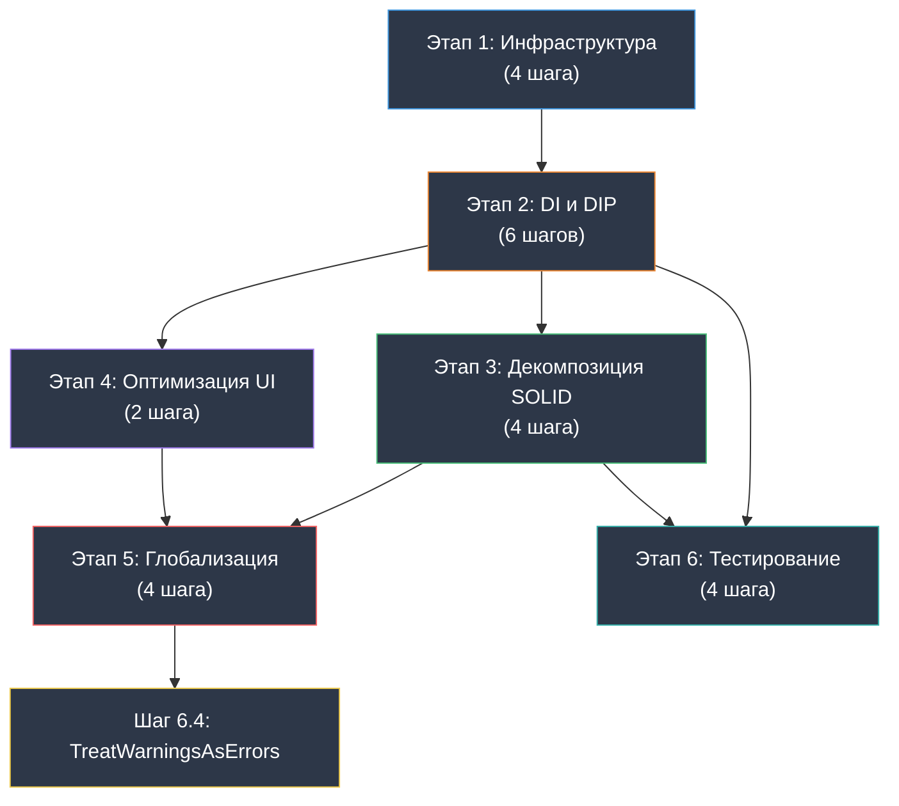

# План рефакторинга проекта K-Tools

## Контекст и цели

Данный план составлен на основе бескомпромиссного аудита кодовой базы десктопного приложения **K-Tools** (WinUI 3 / Windows App SDK / .NET 8). Аудит выявил системные нарушения архитектурных и кодстайл-правил, зафиксированных в `AGENTS.md` и `.github/instructions/`.

**Выявленные системные проблемы:**

| Категория | Суть проблемы | Масштаб |
|-----------|---------------|---------|
| Архитектура (DIP) | Статические синглтоны `.Instance` вместо DI | 50+ вхождений в 18+ файлах |
| Service Locator | `App.Services.GetRequiredService<T>()` для не-ViewModel сервисов в Code-Behind | 4 вхождения в 2 страницах |
| Потокобезопасность | `GetAwaiter().GetResult()` на UI-потоке | 1 критическое место (`VideoEncodingScript.cs:37`) |
| HttpClient | Ручное создание `new HttpClient()` | 2 файла (`DependencyManager`, `UpdateService`) |
| XAML-привязки | `{Binding}` вместо `{x:Bind}` | 6 мест в 2 файлах |
| Code-Behind | Бизнес-логика в контролах | `ScriptSettingsControl.xaml.cs` (66KB), `TrackSelectionControl.xaml.cs` (72KB) |
| Циклическая зависимость | `LogService` ↔ `SettingsManager` через `.Instance` | 2 класса Core-слоя |
| Качество кода | Нет анализаторов, нет `.editorconfig`, нет `TreatWarningsAsErrors` | Весь проект |
| Локализация | Захардкоженные строки UI, нет `.resw` | Весь проект |
| Доступность | Нет `AutomationProperties`, нет `TabIndex` | Все XAML-файлы |
| Тестирование | Нет тестового проекта и юнит-тестов | Весь проект |
| YAGNI | Неиспользуемый класс `SavedFileState` | 1 файл |

**Полный перечень синглтонов `.Instance`:**
1. `LogService.Instance`
2. `SettingsManager.Instance`
3. `DependencyManager.Instance`
4. `ScriptRegistry.Instance`
5. `FFmpegRunner.Instance`
6. `Eac3toRunner.Instance`
7. `MediaProbeService.Instance`
8. `MkvmergeRunner.Instance`

**Полный перечень Service Locator вызовов:**

> **Нативный подход WinUI 3:** Вызовы `GetRequiredService<TViewModel>()` для получения ViewModel страницы являются **допустимым** паттерном, т.к. XAML-компилятор и `Frame.Navigate` требуют конструктор без параметров. Бизнес-логика (обращения к другим сервисам) должна быть перенесена во ViewModels.

| Файл | Строка | Вызов | Статус |
|------|--------|-------|--------|
| `MainPage.xaml.cs` | 37 | `App.Services.GetRequiredService<MainViewModel>()` | ✅ Допустимый (ViewModel) |
| `MainPage.xaml.cs` | 38 | `App.Services.GetRequiredService<INavigationService>()` | ⚠️ Перенести в MainViewModel |
| `MainPage.xaml.cs` | 65 | `App.Services.GetService<IDialogService>()` | ⚠️ Перенести в MainViewModel |
| `DependencySetupPage.xaml.cs` | 36 | `App.Services.GetRequiredService<DependencySetupViewModel>()` | ✅ Допустимый (ViewModel) |
| `HomePage.xaml.cs` | 29 | `App.Services.GetRequiredService<HomeViewModel>()` | ✅ Допустимый (ViewModel) |
| `HomePage.xaml.cs` | 66 | `App.Services.GetRequiredService<ScriptRegistry>()` | ❌ Удалён (перенесён в HomeViewModel) |
| `HomePage.xaml.cs` | 71 | `App.Services.GetRequiredService<INavigationService>()` | ❌ Удалён (перенесён в HomeViewModel) |
| `LogPage.xaml.cs` | 27 | `App.Services.GetRequiredService<LogViewModel>()` | ✅ Допустимый (ViewModel) |
| `SettingsPage.xaml.cs` | 29 | `App.Services.GetRequiredService<SettingsViewModel>()` | ✅ Допустимый (ViewModel) |
| `WorkPanel.xaml.cs` | 55 | `App.Services.GetRequiredService<WorkPanelViewModel>()` | ✅ Допустимый (ViewModel) |

**Принцип Zero-Breakage:** каждый шаг спроектирован так, чтобы после его выполнения проект **гарантированно компилировался и запускался**. Порядок строго инкрементальный: сначала фундамент, затем сервисы, затем потребители.

---

## Этап 1: Инфраструктура и качество кода - ЗАВЕРШЕН

> **Цель:** Настроить инструменты статического анализа и единый код-стайл до начала любых изменений в логике, чтобы все последующие этапы автоматически проверялись анализаторами.

---

### Шаг 1.1 — Создание `.editorconfig` в корне решения - ЗАВЕРШЕН

**Действие:**
Создать файл `.editorconfig` в каталоге `F:\Programming\Utils\k-tools\` с правилами:
- Отступы: 4 пробела для C#, 2 пробела для XAML/XML/JSON.
- Кодировка: UTF-8 с BOM для C# файлов.
- Правила именования: `PascalCase` для публичных членов, `_camelCase` для приватных полей, `camelCase` для локальных переменных и параметров.
- Включить правила `dotnet_style_*` и `csharp_style_*` в соответствии с Microsoft C# Coding Conventions.
- Установить severity для ключевых диагностик (IDE0005, IDE0044, IDE0051, IDE0060 и т.д.).

**Файлы:**
- `[NEW]` `.editorconfig`

**Критерий приёмки:**
Файл `.editorconfig` существует в корне решения. Выполнить `dotnet build -c Debug -p:Platform=x64` — проект собирается без ошибок.

---

### Шаг 1.2 — Подключение Roslyn-анализаторов и StyleCop - ЗАВЕРШЕН

**Действие:**
1. Добавить в `KTools.App.csproj` NuGet-пакеты:
   - `Microsoft.CodeAnalysis.NetAnalyzers` (последняя стабильная версия).
   - `StyleCop.Analyzers` (последняя стабильная версия).
2. Установить свойства в `<PropertyGroup>`:
   - `<EnforceCodeStyleInBuild>true</EnforceCodeStyleInBuild>`
   - `<AnalysisLevel>latest-recommended</AnalysisLevel>`
3. Создать файл `stylecop.json` в каталоге `KTools.App/` с базовой конфигурацией:
   - `"documentationRules.documentInterfaces": false` (на первом этапе).
   - `"orderingRules.usingDirectivesPlacement": "outsideNamespace"`.
   - `"namingRules.allowCommonHungarianPrefixes": false`.

> **⚠️ ВАЖНО:** НЕ включать `<TreatWarningsAsErrors>true</TreatWarningsAsErrors>` на этом шаге! Анализаторы выдадут сотни предупреждений на существующем коде. Сначала нужно подавить исторические предупреждения, а `TreatWarningsAsErrors` включить только на Этапе 6 после полной стабилизации.

**Файлы:**
- `[MODIFY]` `KTools.App/KTools.App.csproj`
- `[NEW]` `KTools.App/stylecop.json`

**Критерий приёмки:**
Пакеты установлены, `stylecop.json` присутствует. Выполнить `dotnet build -c Debug -p:Platform=x64` — проект собирается без **ошибок** (предупреждения допускаются).

---

### Шаг 1.3 — Подавление исторических предупреждений анализаторов - ЗАВЕРШЕН

**Действие:**
1. Выполнить сборку и собрать полный список предупреждений от новых анализаторов.
2. Для каждого файла, где предупреждения **не** связаны с текущим рефакторингом, добавить точечные `#pragma warning disable` с комментарием `// TODO: Рефакторинг — Этап N` и ссылкой на соответствующий этап плана.
3. Альтернативно: добавить подавление на уровне `.editorconfig` для категорий правил, которые будут исправлены на конкретных этапах (например, правила документации — на Этапе 5).

**Файлы:**
- `[MODIFY]` Затронутые файлы `.cs` (точечные `#pragma`)
- или `[MODIFY]` `.editorconfig` (групповое подавление)

**Критерий приёмки:**
Выполнить `dotnet build -c Debug -p:Platform=x64` — проект собирается **без ошибок и без предупреждений** (все подавлены осознанно).

---

### Шаг 1.4 — Удаление неиспользуемого кода (YAGNI) - ЗАВЕРШЕН

**Действие:**
Удалить файл `SavedFileState.cs`, который нигде не используется в проекте (подтверждено grep-поиском: ноль ссылок за пределами самого файла).

**Файлы:**
- `[DELETE]` `KTools.App/Core/SavedFileState.cs`

**Критерий приёмки:**
Файл удалён. Выполнить `dotnet build -c Debug -p:Platform=x64` — проект собирается без ошибок.

---

### 🔒 Контрольная точка Этапа 1 - ЗАВЕРШЕНА

```
dotnet build -c Debug -p:Platform=x64
```

**Ожидаемый результат:** 0 ошибок, 0 предупреждений. Анализаторы подключены и активны. Проект запускается и работает идентично оригиналу.

---

## Этап 2: Изоляция зависимостей и удаление Service Locator / Синглтонов

> **Цель:** Перевести проект на инверсию зависимостей (DIP) через конструкторное внедрение. Убрать все обращения к `.Instance` и перенести бизнес-логику из Code-Behind во ViewModels. После этого этапа каждый класс будет зависеть только от интерфейсов, полученных через конструктор.
>
> **Допустимое исключение (нативный подход WinUI 3):** В Code-Behind страниц допускается **единственный** вызов `App.Services.GetRequiredService<TViewModel>()` для получения ViewModel данной страницы. Это стандартный паттерн из MVVM Toolkit, поскольку XAML-компилятор и `Frame.Navigate` требуют параметрлесный конструктор. Все остальные зависимости страницы внедряются строго через конструктор ViewModel.

**Стратегия безопасного перехода (The Strangler Fig Pattern):**
1. Создаём интерфейсы — ничего не ломается.
2. Реализуем интерфейсы в существующих классах — ничего не ломается.
3. Регистрируем реализации в DI (через существующие `.Instance`) — ничего не ломается.
4. Переносим бизнес-логику из Code-Behind во ViewModels, сохраняя нативную навигацию `Frame.Navigate`.
5. Поочерёдно переводим потребителей с `.Instance` на конструкторное внедрение — каждое переключение атомарно.
6. В конце удаляем свойства `.Instance` и статику.

> **⚠️ КРИТИЧЕСКАЯ ЗАВИСИМОСТЬ — Циклическая связь `LogService ↔ SettingsManager`:**
> `SettingsManager` вызывает `LogService.Instance` в методах `SetSetting()`/`SaveSettings()`.
> `LogService` вызывает `SettingsManager.Instance` в `InitializeLogFile()` для получения пути к логам.
> Эта циклическая зависимость должна быть разорвана на Шаге 2.2 через **ленивую инициализацию** (`Lazy<ILogService>` в `SettingsManager`) или через **паттерн Options** (передача пути к логам как `IOptions<LogServiceOptions>` вместо чтения из `SettingsManager`).

---

### Шаг 2.1 — Создание интерфейсов для Core-сервисов и Infrastructure - ЗАВЕРШЕН

**Действие:**
Создать интерфейсы в каталоге `Services/Contracts/`:

**Core-сервисы:**

1. `ILogService` — контракт для `LogService`:
   - Методы: `Info(string)`, `Warning(string)`, `Error(string, Exception?)`, `Debug(string)`, `Fatal(string, Exception?)`, `LogExceptionDetails(Exception, string)`.

2. `ISettingsManager` — контракт для `SettingsManager`:
   - Свойства: `OutputPath`, `OverwriteFiles`, `CheckForUpdates`, `LastDependencyCheck`, `PreferredLanguage`, `MaxParallelProcesses`, `Theme`, `UseHardwareAcceleration`, `ShowNotifications` (все с get/set).
   - Методы: `SaveSettings()`, `LoadSettings()`, `InitializeDefaults(IEnumerable<...>)`.

3. `IDependencyManager` — контракт для `DependencyManager`:
   - Методы: `GetToolPath(string)`, `CheckDependenciesAsync()`, `DownloadDependencyAsync(string, IProgress<double>?)`.
   - Свойства: `IsAllDependenciesAvailable`.

4. `IPathManager` — контракт для `PathManager`:
   - Свойства: `AppDirectory`, `DependenciesDirectory`, `TempDirectory`, `LogDirectory`, `SettingsFilePath` (только get).
   - Методы: `EnsureDirectoriesExist()`, `GetDependencyPath(string)`.

5. `IScriptRegistry` — контракт для `ScriptRegistry`:
   - Методы: `GetScript(string)`, `GetAllScripts()`, `GetScriptsByCategory(string)`.

**Infrastructure-сервисы (Runner'ы):**

6. `IFFmpegRunner` — контракт для `FFmpegRunner`:
   - Методы, вызываемые скриптами (кодирование, проверка NVENC и т.д.).

7. `IEac3toRunner` — контракт для `Eac3toRunner`:
   - Методы запуска процесса `eac3to`.

8. `IMediaProbeService` — контракт для `MediaProbeService`:
   - Методы зондирования медиафайлов.

9. `IMkvmergeRunner` — контракт для `MkvmergeRunner`:
   - Методы запуска `mkvmerge`.

> **Важно:** Интерфейсы должны содержать XML-документацию на русском языке для каждого метода и свойства.

**Файлы:**
- `[NEW]` `KTools.App/Services/Contracts/ILogService.cs`
- `[NEW]` `KTools.App/Services/Contracts/ISettingsManager.cs`
- `[NEW]` `KTools.App/Services/Contracts/IDependencyManager.cs`
- `[NEW]` `KTools.App/Services/Contracts/IPathManager.cs`
- `[NEW]` `KTools.App/Services/Contracts/IScriptRegistry.cs`
- `[NEW]` `KTools.App/Services/Contracts/IFFmpegRunner.cs`
- `[NEW]` `KTools.App/Services/Contracts/IEac3toRunner.cs`
- `[NEW]` `KTools.App/Services/Contracts/IMediaProbeService.cs`
- `[NEW]` `KTools.App/Services/Contracts/IMkvmergeRunner.cs`

**Критерий приёмки:**
Интерфейсы созданы. Выполнить `dotnet build -c Debug -p:Platform=x64` — проект собирается без ошибок. Существующая логика не затронута.

---

### Шаг 2.2 — Реализация интерфейсов в существующих классах и разрыв циклической зависимости - ЗАВЕРШЕН

**Действие:**

**A. Объявить реализацию интерфейсов в заголовках существующих классов:**
- `LogService : ILogService`
- `SettingsManager : ISettingsManager`
- `DependencyManager : IDependencyManager`
- `ScriptRegistry : IScriptRegistry`
- `FFmpegRunner : IFFmpegRunner`
- `Eac3toRunner : IEac3toRunner`
- `MediaProbeService : IMediaProbeService`
- `MkvmergeRunner : IMkvmergeRunner`

**B. Разрыв циклической зависимости `LogService ↔ SettingsManager`:**

Выбрать **один** из подходов:

**Вариант A (рекомендуемый) — Options Pattern:**
1. Создать `LogServiceOptions` с единственным свойством `LogDirectory`.
2. `LogService` принимает `IOptions<LogServiceOptions>` вместо чтения `SettingsManager.Instance`.
3. `SettingsManager` зависит от `ILogService` без обратной связи.
4. В `App.xaml.cs` конфигурировать: `services.Configure<LogServiceOptions>(o => o.LogDirectory = PathManager.LogDirectory)`.

**Вариант B — Lazy Injection:**
1. `SettingsManager` принимает `Lazy<ILogService>` вместо прямого `ILogService`.
2. DI-контейнер разрешает `Lazy<T>` автоматически.

**C. Преобразование `PathManager`:**
Поскольку `PathManager` — полностью статический класс, создать нестатический класс `PathManagerService : IPathManager`, который делегирует вызовы статическому `PathManager`. На Шаге 2.6 статический `PathManager` будет удалён.

**Файлы:**
- `[MODIFY]` `KTools.App/Core/LogService.cs` — добавить `: ILogService`, опционально принять `IOptions<LogServiceOptions>`
- `[MODIFY]` `KTools.App/Core/SettingsManager.cs` — добавить `: ISettingsManager`
- `[MODIFY]` `KTools.App/Core/DependencyManager.cs` — добавить `: IDependencyManager`
- `[NEW]` `KTools.App/Core/PathManagerService.cs` — обёртка-делегат над статическим `PathManager`
- `[MODIFY]` `KTools.App/Scripts/ScriptRegistry.cs` — добавить `: IScriptRegistry`
- `[MODIFY]` `KTools.App/Infrastructure/FFmpegRunner.cs` — добавить `: IFFmpegRunner`
- `[MODIFY]` `KTools.App/Infrastructure/Eac3toRunner.cs` — добавить `: IEac3toRunner`
- `[MODIFY]` `KTools.App/Core/MediaProbeService.cs` — добавить `: IMediaProbeService`
- `[MODIFY]` `KTools.App/Infrastructure/MkvmergeRunner.cs` — добавить `: IMkvmergeRunner`
- `[NEW]` `KTools.App/Core/LogServiceOptions.cs` (если выбран Вариант A)

**Критерий приёмки:**
Классы реализуют соответствующие интерфейсы. Свойства `.Instance` и статические методы **остаются на месте** (обратная совместимость). Циклическая зависимость между `LogService` и `SettingsManager` разорвана. Выполнить `dotnet build -c Debug -p:Platform=x64` — проект собирается без ошибок.

---

### Шаг 2.3 — Регистрация Core-сервисов в DI-контейнере

**Действие:**
В файле `App.xaml.cs` в методе `ConfigureServices()` зарегистрировать **все** Core и Infrastructure-сервисы:
```csharp
// Core-сервисы (переходная регистрация через существующие .Instance)
services.AddSingleton<ILogService>(LogService.Instance);
services.AddSingleton<ISettingsManager>(SettingsManager.Instance);
services.AddSingleton<IDependencyManager>(DependencyManager.Instance);
services.AddSingleton<IPathManager, PathManagerService>();
services.AddSingleton<IScriptRegistry>(ScriptRegistry.Instance);

// Infrastructure-сервисы (Runner'ы)
services.AddSingleton<IFFmpegRunner>(FFmpegRunner.Instance);
services.AddSingleton<IEac3toRunner>(Eac3toRunner.Instance);
services.AddSingleton<IMediaProbeService>(MediaProbeService.Instance);
services.AddSingleton<IMkvmergeRunner>(MkvmergeRunner.Instance);
```

> **Примечание:** На данном шаге мы регистрируем существующие экземпляры синглтонов. Это переходная мера — она позволяет потребителям начать получать зависимости через конструктор, не меняя жизненный цикл самих сервисов. Полное удаление синглтонов произойдёт на Шаге 2.6.

**Файлы:**
- `[MODIFY]` `KTools.App/App.xaml.cs`

**Критерий приёмки:**
Все 9 сервисов зарегистрированы в DI. Выполнить `dotnet build -c Debug -p:Platform=x64` — проект собирается без ошибок. Приложение запускается, поведение идентично оригиналу.

---

### Шаг 2.4 — Нативная интеграция DI для страниц (перенос логики в ViewModels) - ЗАВЕРШЕН

> **⚠️ ВАЖНО — Изменение подхода (по результатам Deep Research аудита):**
> Первоначальный план предполагал создание кастомной `PageFactory` с ручной инстанциацией страниц (`Frame.Content = new Page(...)`) и конструкторами с DI-параметрами. Этот подход **отвергнут** как нарушающий нативную модель навигации WinUI 3:
> - **Ломается встроенная история переходов** (`BackStack`, `CanGoBack`).
> - **Отключаются системные анимации переходов** (требуется вручную реализовывать `NavigationTransitionInfo`).
> - **Нарушается `NavigationCacheMode`** (кэширование страниц).
> - **Несовместимость с XAML-компилятором**, который требует параметрлесный конструктор.
>
> Вместо этого принят **Подход №1 из отчёта Deep Research** (рекомендуемый Microsoft):
> страницы сохраняют конструктор по умолчанию и получают ViewModel из DI-контейнера.
> Вся бизнес-логика из code-behind перемещается во ViewModels, которые используют полноценный Constructor DI.
> Навигация осуществляется стандартным `Frame.Navigate(typeof(Page), parameter)`.

**Действие:**
1. **Страницы** сохраняют параметрлесный конструктор для совместимости с XAML и `Frame.Navigate`:
   ```csharp
   public sealed partial class MyPage : Page
   {
       public MyViewModel ViewModel { get; }

       public MyPage()
       {
           ViewModel = App.Services.GetRequiredService<MyViewModel>();
           this.InitializeComponent();
       }
   }
   ```
   > Допускается единственный вызов `App.Services.GetRequiredService<TViewModel>()` в конструкторе страницы
   > для получения **только** её ViewModel. Это стандартный паттерн из MVVM Toolkit.
   > Обращения к любым другим сервисам (`IScriptRegistry`, `INavigationService` и др.) в code-behind **запрещены** —
   > эти зависимости должны быть внедрены во ViewModel.

2. **Перенести всю бизнес-логику** из Code-Behind страниц во ViewModels:
   - Вызовы `App.Services.GetRequiredService<INavigationService>()` → заменить на `INavigationService` в конструкторе ViewModel.
   - Вызовы `App.Services.GetRequiredService<ScriptRegistry>()` → заменить на `IScriptRegistry` в конструкторе ViewModel.
   - Обработчики событий, содержащие логику → заменить на `[RelayCommand]` во ViewModel, вызываемые через `{x:Bind}`.

3. **Навигация** остаётся нативной — `Frame.Navigate(typeof(Page), parameter)`.
   `NavigationService` использует стандартный `Frame.Navigate`, не создавая экземпляры страниц вручную.

**Файлы:**
- `[MODIFY]` `KTools.App/UI/Pages/HomePage.xaml.cs` — удалить лишние сервисы из code-behind, оставить только `HomeViewModel`
- `[MODIFY]` `KTools.App/ViewModels/HomeViewModel.cs` — принять `IScriptRegistry`, `INavigationService` через конструктор

**Критерий приёмки:**
Grep по `App\.Services\.GetRequiredService` и `App\.Services\.GetService` в Code-Behind файлах (`*.xaml.cs`) возвращает **только** вызовы для получения ViewModel данной страницы (по одному на страницу). Логика навигации и получения данных находится во ViewModels. Навигация через `Frame.Navigate` работает со стандартными анимациями и BackStack. Выполнить `dotnet build -c Debug -p:Platform=x64` — проект собирается без ошибок.

---

### Шаг 2.5 — Перевод потребителей на конструкторное внедрение (замена `.Instance`)

**Действие:**
Поочерёдно заменить **все** обращения к `.Instance` на внедрение через конструктор. Порядок обработки — от нижнего уровня к верхнему. **Выполнять `dotnet build` после каждой группы.**

**Группа A — Infrastructure Runner'ы (нижний уровень):**

| Файл | Заменить | На |
|------|----------|----|
| `Eac3toRunner.cs` | `LogService.Instance`, `DependencyManager.Instance` | `ILogService`, `IDependencyManager` в конструкторе |
| `FFmpegRunner.cs` | `LogService.Instance` и др. `.Instance` | Конструкторное внедрение |
| `MkvmergeRunner.cs` | `.Instance` вызовы | Конструкторное внедрение |
| `QaacRunner.cs` | `.Instance` вызовы | Конструкторное внедрение |
| `DeeRunner.cs` | `.Instance` вызовы | Конструкторное внедрение |

> 🔒 `dotnet build -c Debug -p:Platform=x64` после группы A.

**Группа B — Core-сервисы (средний уровень):**

| Файл | Заменить | На |
|------|----------|----|
| `MediaProbeService.cs` | `LogService.Instance`, `DependencyManager.Instance` | `ILogService`, `IDependencyManager` в конструкторе |
| `DependencyManager.cs` | `LogService.Instance`, `new HttpClient()` | `ILogService`, `IHttpClientFactory` в конструкторе |
| `SettingsManager.cs` | `LogService.Instance` | `ILogService` (или `Lazy<ILogService>`) в конструкторе |
| `ScriptRegistry.cs` | `SettingsManager.Instance` | `ISettingsManager` в конструкторе |

> 🔒 `dotnet build -c Debug -p:Platform=x64` после группы B.

**Группа C — Scripts (средний уровень):**

| Файл | Заменить | На |
|------|----------|----|
| `AbstractScript.cs` | `LogService.Instance`, `SettingsManager.Instance` (~20 вхождений) | `ILogService`, `ISettingsManager` в конструкторе/базовом классе |
| `VideoEncodingScript.cs` | `FFmpegRunner.Instance`, `MediaProbeService.Instance`, `SettingsManager.Instance` | Конструкторное внедрение |
| `AudioChannelsScript.cs` | `.Instance` вызовы | Конструкторное внедрение |
| `AudioDownmixScript.cs` | `.Instance` вызовы | Конструкторное внедрение |
| `AudioEncodingScript.cs` | `.Instance` вызовы | Конструкторное внедрение |
| `AudioSpeedScript.cs` | `.Instance` вызовы | Конструкторное внедрение |
| `ContainerConversionScript.cs` | `.Instance` вызовы | Конструкторное внедрение |
| `MetadataCleanupScript.cs` | `.Instance` вызовы | Конструкторное внедрение |
| `MkvAssemblyScript.cs` | `.Instance` вызовы | Конструкторное внедрение |
| `StreamManagementScript.cs` | `.Instance` вызовы | Конструкторное внедрение |
| `StreamReplacementScript.cs` | `.Instance` вызовы | Конструкторное внедрение |
| `SubtitlesConvertScript.cs` | `.Instance` вызовы | Конструкторное внедрение |
| `TrackExtractorScript.cs` | `.Instance` вызовы | Конструкторное внедрение |

> **Примечание к скриптам:** Базовый класс `AbstractScript` (32KB) содержит ~20 вызовов `.Instance`. Оптимальная стратегия — добавить `ILogService` и `ISettingsManager` как `protected` свойства базового класса, внедряемые через конструктор. Все наследники передают зависимости через `base(logService, settingsManager, ...)`.
>
> Если `ScriptRegistry` создаёт скрипты через `new`, необходимо обновить его для получения скриптов из DI-контейнера. Зарегистрировать все скрипты как `Transient` в `App.xaml.cs`.

> 🔒 `dotnet build -c Debug -p:Platform=x64` после группы C.

**Группа D — Services (средний уровень):**

| Файл | Заменить | На |
|------|----------|----|
| `UpdateService.cs` | `LogService.Instance`, `SettingsManager.Instance`, `new HttpClient()` | `ILogService`, `ISettingsManager`, `IHttpClientFactory` в конструкторе |
| `DialogService.cs` | Если использует `.Instance` | Конструкторное внедрение |
| `NavigationService.cs` | Если использует `.Instance` | Конструкторное внедрение |
| `NotificationService.cs` | Если использует `.Instance` | Конструкторное внедрение |

> 🔒 `dotnet build -c Debug -p:Platform=x64` после группы D.

**Группа E — ViewModels (верхний уровень):**

| Файл | Заменить | На |
|------|----------|----|
| `MainViewModel.cs` | `ScriptRegistry.Instance` | `IScriptRegistry` в конструкторе |
| `SettingsViewModel.cs` | `SettingsManager.Instance`, `DependencyManager.Instance` | `ISettingsManager`, `IDependencyManager` в конструкторе |
| `WorkPanelViewModel.cs` | `LogService.Instance`, `SettingsManager.Instance`, `DependencyManager.Instance` | `ILogService`, `ISettingsManager`, `IDependencyManager` в конструкторе |
| `HomeViewModel.cs` | Если использует `.Instance` | Конструкторное внедрение |
| `DependencySetupViewModel.cs` | Если использует `.Instance` | Конструкторное внедрение |
| `LogViewModel.cs` | Если использует `.Instance` | Конструкторное внедрение |
| `SubtitlePreviewViewModel.cs` | Если использует `.Instance` | Конструкторное внедрение |

> 🔒 `dotnet build -c Debug -p:Platform=x64` после группы E.

**Группа F — Window и оставшиеся (верхний уровень):**

| Файл | Заменить | На |
|------|----------|----|
| `MainWindow.xaml.cs` | `SettingsManager.Instance.Theme` | `ISettingsManager` в конструкторе |
| `FFmpegOutputParser.cs` | `LogService.Instance` (если используется) | `ILogService` в конструкторе |

> 🔒 `dotnet build -c Debug -p:Platform=x64` после группы F.

**Шаг 2.5.1 — Замена ручных HttpClient на IHttpClientFactory:**

1. Добавить NuGet-пакет `Microsoft.Extensions.Http` в `KTools.App.csproj`.
2. В `App.xaml.cs` зарегистрировать: `services.AddHttpClient()`.
3. В `DependencyManager` и `UpdateService` заменить `private static readonly HttpClient` / `new HttpClient()` на `IHttpClientFactory` через конструктор и вызов `_httpClientFactory.CreateClient()`.

**Файлы (сводный список группы A–F + 2.5.1):**
- `[MODIFY]` `KTools.App/KTools.App.csproj` — добавить `Microsoft.Extensions.Http`
- `[MODIFY]` `KTools.App/App.xaml.cs` — регистрация всех скриптов, `AddHttpClient()`, обновление регистраций
- `[MODIFY]` Все файлы из таблиц выше (Infrastructure, Core, Scripts, Services, ViewModels, Window)

**Критерий приёмки:**
Grep по `\.Instance` в каталоге `KTools.App/` возвращает результаты **только** в файлах-определениях синглтонов (свойства `Instance` в самих классах). Grep по `new HttpClient` возвращает 0 результатов. Выполнить `dotnet build -c Debug -p:Platform=x64` — проект собирается без ошибок.

---

### Шаг 2.6 — Удаление свойств `.Instance` и преобразование синглтонов

**Действие:**
После того как **все** потребители переведены на конструкторное внедрение:

1. Удалить `private static readonly Lazy<T>` и `public static T Instance` из **всех 8 синглтонов**:
   - `LogService`, `SettingsManager`, `DependencyManager`, `ScriptRegistry`
   - `FFmpegRunner`, `Eac3toRunner`, `MediaProbeService`, `MkvmergeRunner`

2. Обновить регистрацию в `App.xaml.cs` на стандартную DI-регистрацию:
   ```csharp
   // Было:
   services.AddSingleton<ILogService>(LogService.Instance);
   // Стало:
   services.AddSingleton<ILogService, LogService>();
   ```

3. Обеспечить, чтобы конструкторы классов принимали свои зависимости через DI:
   - `LogService` — `IOptions<LogServiceOptions>` (или без зависимостей, если путь к логам берётся из `IPathManager`).
   - `SettingsManager` — `IPathManager`, `ILogService` (или `Lazy<ILogService>`).
   - `DependencyManager` — `IPathManager`, `ILogService`, `IHttpClientFactory`.
   - `ScriptRegistry` — `IServiceProvider` (для разрешения скриптов), `ISettingsManager`.
   - `FFmpegRunner` — `ILogService`, `IPathManager` или `IDependencyManager`.
   - И аналогично для остальных Runner'ов.

4. Удалить класс-обёртку `PathManagerService.cs` и преобразовать `PathManager` из статического класса в `sealed class PathManager : IPathManager`.

5. Удалить или сделать `internal` статическое свойство `App.Services`.

**Файлы:**
- `[MODIFY]` `KTools.App/Core/LogService.cs` — удалить `Lazy<>` и `Instance`
- `[MODIFY]` `KTools.App/Core/SettingsManager.cs` — удалить `Lazy<>` и `Instance`
- `[MODIFY]` `KTools.App/Core/DependencyManager.cs` — удалить `Lazy<>` и `Instance`
- `[MODIFY]` `KTools.App/Core/PathManager.cs` — преобразовать из static в sealed + IPathManager
- `[MODIFY]` `KTools.App/Core/MediaProbeService.cs` — удалить `Lazy<>` и `Instance`
- `[DELETE]` `KTools.App/Core/PathManagerService.cs` — больше не нужен
- `[MODIFY]` `KTools.App/Scripts/ScriptRegistry.cs` — удалить `Lazy<>` и `Instance`
- `[MODIFY]` `KTools.App/Infrastructure/FFmpegRunner.cs` — удалить `Lazy<>` и `Instance`
- `[MODIFY]` `KTools.App/Infrastructure/Eac3toRunner.cs` — удалить `Lazy<>` и `Instance`
- `[MODIFY]` `KTools.App/Infrastructure/MkvmergeRunner.cs` — удалить `Lazy<>` и `Instance`
- `[MODIFY]` `KTools.App/App.xaml.cs` — обновить регистрации, удалить/скрыть `App.Services`

**Критерий приёмки:**
Grep по `\.Instance` в каталоге `KTools.App/` возвращает **0 результатов** (исключая `CodePagesEncodingProvider.Instance` — это фреймворковый вызов, допустимо). Grep по `static.*Lazy<` возвращает 0 результатов. Ни один класс Core/Infrastructure слоя не содержит статических синглтон-полей. Выполнить `dotnet build -c Debug -p:Platform=x64` — проект собирается без ошибок.

---

### 🔒 Контрольная точка Этапа 2

```
dotnet build -c Debug -p:Platform=x64
```

**Ожидаемый результат:** 0 ошибок. Проект полностью переведён на DI. Все зависимости сервисов и ViewModels внедряются через конструкторы. Вызовы `App.Services` в Code-Behind ограничены получением ViewModel (нативный подход WinUI 3). Все 8 синглтонов `.Instance` удалены. Циклическая зависимость разорвана. Проект запускается, вся функциональность сохранена.

---

## Этап 3: Декомпозиция логики и соответствие SOLID

> **Цель:** Разгрузить классы, нарушающие SRP, и перенести бизнес-логику из Code-Behind в ViewModels.

---

### Шаг 3.1 — Декомпозиция `AppConstants.cs` (486 строк)

**Действие:**
Разбить монолитный `AppConstants.cs` на логически связанные файлы:

1. `Core/Constants/MediaConstants.cs` — расширения медиафайлов (`VideoExtensions`, `AudioExtensions`, `SubtitleExtensions`).
2. `Core/Constants/LanguageConstants.cs` — ISO-карты языков.
3. `Core/Constants/ScriptConstants.cs` — метаданные скриптов (имена, описания, категории) — временно, до Шага 3.3.

Оставить в `AppConstants.cs` только общие константы приложения (версия, имя приложения и т.д.), либо удалить файл полностью, если всё перенесено.

**Файлы:**
- `[NEW]` `KTools.App/Core/Constants/MediaConstants.cs`
- `[NEW]` `KTools.App/Core/Constants/LanguageConstants.cs`
- `[NEW]` `KTools.App/Core/Constants/ScriptConstants.cs`
- `[MODIFY]` или `[DELETE]` `KTools.App/Core/AppConstants.cs`
- `[MODIFY]` Все файлы, ссылающиеся на `AppConstants.*` — обновить ссылки

**Критерий приёмки:**
Каждый файл констант содержит семантически связанные данные. Файл `AppConstants.cs` либо удалён, либо содержит ≤ 50 строк. Выполнить `dotnet build -c Debug -p:Platform=x64` — проект собирается без ошибок.

---

### Шаг 3.2 — Извлечение бизнес-логики из крупных Code-Behind файлов

**Действие:**
Это самая сложная задача рефакторинга. В проекте **два** критически раздутых Code-Behind:
- `ScriptSettingsControl.xaml.cs` — **66KB**
- `TrackSelectionControl.xaml.cs` — **72KB**

Выполнять **поэтапно, с микрокоммитами, начиная с меньшего файла:**

---

#### Подшаг 3.2.1 — Декомпозиция `ScriptSettingsControl.xaml.cs`

1. Создать `ViewModels/ScriptSettingsViewModel.cs`.
2. Перенести из Code-Behind в ViewModel:
   - Логику генерации UI-полей настроек скрипта.
   - Валидацию значений настроек.
   - Коллекции данных (типы настроек, значения по умолчанию).
   - Команды сохранения/сброса (`[RelayCommand]`).
3. Оставить в Code-Behind **только**: `InitializeComponent()`, инициализацию `DataContext`, обработчики визуальных событий.
4. Зарегистрировать `ScriptSettingsViewModel` в `App.xaml.cs`.

**Файлы:**
- `[NEW]` `KTools.App/ViewModels/ScriptSettingsViewModel.cs`
- `[MODIFY]` `KTools.App/UI/Controls/ScriptSettingsControl.xaml.cs` — удалить перенесённую логику
- `[MODIFY]` `KTools.App/UI/Controls/ScriptSettingsControl.xaml` — обновить привязки
- `[MODIFY]` `KTools.App/App.xaml.cs` — регистрация ViewModel

> 🔒 `dotnet build -c Debug -p:Platform=x64` — проект собирается без ошибок.

---

#### Подшаг 3.2.2 — Декомпозиция `TrackSelectionControl.xaml.cs`

1. Создать `ViewModels/TrackSelectionViewModel.cs`.
2. Перенести из Code-Behind в ViewModel:
   - Логику построения дерева дорожек.
   - Логику фильтрации и поиска.
   - Коллекции данных (`ObservableCollection<T>` для дорожек).
   - Команды выбора/отмены дорожек (`[RelayCommand]`).
3. Оставить в Code-Behind **только**: `InitializeComponent()`, инициализацию `DataContext`, обработчики UI-событий (drag-drop, визуальные эффекты).
4. Зарегистрировать `TrackSelectionViewModel` в `App.xaml.cs`.

**Файлы:**
- `[NEW]` `KTools.App/ViewModels/TrackSelectionViewModel.cs`
- `[MODIFY]` `KTools.App/UI/Controls/TrackSelectionControl.xaml.cs` — удалить перенесённую логику
- `[MODIFY]` `KTools.App/UI/Controls/TrackSelectionControl.xaml` — обновить привязки
- `[MODIFY]` `KTools.App/App.xaml.cs` — регистрация ViewModel

> 🔒 `dotnet build -c Debug -p:Platform=x64` — проект собирается без ошибок.

**Критерий приёмки (для обоих подшагов):**
`ScriptSettingsControl.xaml.cs` содержит ≤ 200 строк. `TrackSelectionControl.xaml.cs` содержит ≤ 200 строк. Вся бизнес-логика находится в соответствующих ViewModels. Функциональность контролов работает идентично оригиналу.

---

### Шаг 3.3 — Устранение дублирования метаданных скриптов (DRY)

**Действие:**
Метаданные скриптов дублируются в трёх местах:
- `AppConstants.cs` / `ScriptConstants.cs` (после Шага 3.1)
- `MainViewModel.cs` — список `ScriptInfos` (дублирует 12 скриптов)
- `HomeViewModel.cs` — список `Categories` (дублирует категории)

Устранить дублирование:
1. Определить каноническое место хранения — в самих классах скриптов (свойства `Name`, `Description`, `Category` базового класса `AbstractScript` / `ScriptBase`).
2. `IScriptRegistry.GetAllScripts()` возвращает полный список с метаданными.
3. `MainViewModel` и `HomeViewModel` получают списки и категории через `IScriptRegistry`.
4. Удалить дублирующие данные из `ScriptConstants.cs` (если файл становится пустым — удалить).

**Файлы:**
- `[MODIFY]` `KTools.App/ViewModels/MainViewModel.cs` — получать скрипты из `IScriptRegistry`
- `[MODIFY]` `KTools.App/ViewModels/HomeViewModel.cs` — получать категории из `IScriptRegistry`
- `[MODIFY]` или `[DELETE]` `KTools.App/Core/Constants/ScriptConstants.cs`

**Критерий приёмки:**
Метаданные скриптов определены в единственном месте. Grep по дублирующимся строкам показывает вхождения только в определениях классов скриптов. Выполнить `dotnet build -c Debug -p:Platform=x64` — проект собирается без ошибок.

---

### Шаг 3.4 — Устранение дублирования в `AbstractScript.cs`

**Действие:**
В `AbstractScript.cs` обнаружены два почти идентичных блока кода:
- `GetSafeOutputPath` (строки ~326-344)
- Второй блок (строки ~447-464) с аналогичной логикой обращения к `SettingsManager`

Выделить общую логику в приватный метод, вызываемый из обоих мест.

**Файлы:**
- `[MODIFY]` `KTools.App/Core/AbstractScript.cs`

**Критерий приёмки:**
Нет дублирующихся блоков кода в `AbstractScript.cs`. Выполнить `dotnet build -c Debug -p:Platform=x64` — проект собирается без ошибок.

---

### 🔒 Контрольная точка Этапа 3

```
dotnet build -c Debug -p:Platform=x64
```

**Ожидаемый результат:** 0 ошибок. Логика декомпозирована по SRP. Крупные Code-Behind файлы разгружены. DRY-дублирование устранено. Проект запускается, вся функциональность сохранена.

---

## Этап 4: Оптимизация UI и XAML

> **Цель:** Устранить блокировки UI-потока, заменить рефлективные привязки на скомпилированные, улучшить производительность рендеринга.

---

### Шаг 4.1 — Устранение блокировки UI-потока в `VideoEncodingScript.cs`

**Действие:**
Заменить блокирующий вызов на строке 37:
```csharp
// ❌ Блокирует UI-поток
public bool IsNvencSupported =>
    Task.Run(() => FFmpegRunner.Instance.CheckNvencSupportAsync()).GetAwaiter().GetResult();
```

На полностью асинхронный подход:
```csharp
// ✅ Асинхронная инициализация
[ObservableProperty]
private bool _isNvencSupported;

public async Task InitializeAsync()
{
    IsNvencSupported = await Task.Run(() => _ffmpegRunner.CheckNvencSupportAsync());
}
```

Обновить вызывающий код для асинхронной инициализации скрипта при его выборе пользователем (например, вызывать `InitializeAsync()` из `WorkPanelViewModel` при активации скрипта `VideoEncoding`).

**Файлы:**
- `[MODIFY]` `KTools.App/Scripts/VideoEncodingScript.cs` — асинхронная инициализация NVENC
- `[MODIFY]` `KTools.App/ViewModels/WorkPanelViewModel.cs` — или другой файл, вызывающий `IsNvencSupported`

**Критерий приёмки:**
Grep по `GetAwaiter().GetResult()` в каталоге `KTools.App/` возвращает 0 результатов. UI не блокируется при проверке поддержки NVENC. Выполнить `dotnet build -c Debug -p:Platform=x64` — проект собирается без ошибок.

---

### Шаг 4.2 — Замена `{Binding}` на `{x:Bind}` в пользовательских контролах

**Действие:**
Заменить все 6 вхождений рефлективных привязок `{Binding}` на скомпилированные привязки `{x:Bind}`:

**`StreamReplaceControl.xaml` (3 привязки):**
- Строка 131: `Text="{Binding FileName}"` → `Text="{x:Bind FileName, Mode=OneWay}"`
- Строка 139: `Text="{Binding InfoText}"` → `Text="{x:Bind InfoText, Mode=OneWay}"`

**`TrackSelectionControl.xaml` (3 привязки):**
- Строка 210: `Margin="{Binding Content.NodeMargin}"` → `Margin="{x:Bind Content.NodeMargin, Mode=OneWay}"`
- Строка 211: `Glyph="{Binding Content.IconGlyph}"` → `Glyph="{x:Bind Content.IconGlyph, Mode=OneWay}"`
- Строка 215: `Text="{Binding Content.Text}"` → `Text="{x:Bind Content.Text, Mode=OneWay}"`
- Строка 216: `FontWeight="{Binding Content.Weight}"` → `FontWeight="{x:Bind Content.Weight, Mode=OneWay}"`

> **Важно:** У `{x:Bind}` режим по умолчанию `OneTime`, а не `OneWay` как у `{Binding}`. Необходимо явно указать `Mode=OneWay` для динамически обновляемых свойств.

> **Примечание:** Привязки в `TreeView`/`ItemsRepeater` через `{x:Bind}` могут потребовать определения `ItemTemplate` с `DataTemplate` с указанием `x:DataType`. Убедиться, что типы данных совместимы.

**Файлы:**
- `[MODIFY]` `KTools.App/UI/Controls/StreamReplaceControl.xaml`
- `[MODIFY]` `KTools.App/UI/Controls/StreamReplaceControl.xaml.cs` — при необходимости добавить публичные свойства
- `[MODIFY]` `KTools.App/UI/Controls/TrackSelectionControl.xaml`

**Критерий приёмки:**
Grep по `{Binding ` (с пробелом) во всех `.xaml` файлах возвращает 0 результатов. Все привязки используют `{x:Bind}`. Функциональность контролов сохранена. Выполнить `dotnet build -c Debug -p:Platform=x64` — проект собирается без ошибок.

---

### 🔒 Контрольная точка Этапа 4

```
dotnet build -c Debug -p:Platform=x64
```

**Ожидаемый результат:** 0 ошибок. UI не блокируется при инициализации. Все привязки скомпилированы. Проект запускается корректно.

---

## Этап 5: Глобализация и доступность

> **Цель:** Подготовить приложение к локализации через ресурсные файлы и обеспечить доступность интерфейса для вспомогательных технологий.

---

### Шаг 5.1 — Создание структуры локализации

**Действие:**
1. Создать каталог `KTools.App/Strings/ru-RU/`.
2. Создать файл `Resources.resw` с ключами для всех захардкоженных строк UI.
3. Начать с наиболее видимых строк:
   - Заголовки страниц (`Главная`, `Настройки`, `Рабочая область`, `Журнал`, `Зависимости`).
   - Метки кнопок (`Выполнить`, `Предпросмотр`, `Удалить`, `Обзор`, `Сбросить`).
   - Описания категорий скриптов.
   - Заголовки и описания настроек.
   - Сообщения об ошибках и уведомления.

**Файлы:**
- `[NEW]` `KTools.App/Strings/ru-RU/Resources.resw`

**Критерий приёмки:**
Файл `Resources.resw` содержит ключи для всех строк, отображаемых в UI. Выполнить `dotnet build -c Debug -p:Platform=x64` — проект собирается без ошибок.

---

### Шаг 5.2 — Замена захардкоженных строк на `x:Uid` в XAML

**Действие:**
Для каждого элемента UI с захардкоженной строкой:
1. Добавить атрибут `x:Uid="UniqueKey"`.
2. Удалить жёстко заданные значения `Text`, `Content`, `Header`, `PlaceholderText`, `Description`.
3. Убедиться, что соответствующие ключи существуют в `Resources.resw` в формате `UniqueKey.Property` (например, `ExecuteButton.Content`, `SettingsPage_ThemeHeader.Text`).

**Файлы:**
- `[MODIFY]` `KTools.App/UI/Pages/HomePage.xaml`
- `[MODIFY]` `KTools.App/UI/Pages/SettingsPage.xaml`
- `[MODIFY]` `KTools.App/UI/Pages/WorkPanel.xaml`
- `[MODIFY]` `KTools.App/UI/Pages/LogPage.xaml`
- `[MODIFY]` `KTools.App/UI/Pages/DependencySetupPage.xaml`
- `[MODIFY]` `KTools.App/UI/Controls/FileListControl.xaml`
- `[MODIFY]` `KTools.App/UI/Controls/StreamReplaceControl.xaml`
- `[MODIFY]` `KTools.App/UI/Controls/TrackSelectionControl.xaml`
- `[MODIFY]` `KTools.App/UI/Controls/ScriptSettingsControl.xaml`
- `[MODIFY]` `KTools.App/MainPage.xaml` (если содержит захардкоженные строки)
- `[MODIFY]` `KTools.App/Strings/ru-RU/Resources.resw` — добавить недостающие ключи

**Критерий приёмки:**
XAML-файлы не содержат захардкоженных русскоязычных строк в атрибутах `Text`, `Content`, `Header`, `Description`. Все строки загружаются из `Resources.resw` через `x:Uid`. Выполнить `dotnet build -c Debug -p:Platform=x64` — проект собирается без ошибок. Интерфейс отображает строки корректно.

---

### Шаг 5.3 — Замена захардкоженных строк в C#-коде

**Действие:**
Для строк, используемых в C#-коде (сообщения об ошибках, уведомления, заголовки диалогов):
1. Использовать `Windows.ApplicationModel.Resources.ResourceLoader` для загрузки строк:
   ```csharp
   private static readonly ResourceLoader _resourceLoader =
       ResourceLoader.GetForViewIndependentUse();

   string message = _resourceLoader.GetString("ErrorFileNotFound");
   ```
2. Добавить соответствующие ключи в `Resources.resw`.

> **Примечание:** Строки логирования (`ILogService.Info/Warning/Error`) на русском языке НЕ нуждаются в локализации — логи всегда пишутся на русском (правило из `user_global`). Локализации подлежат только строки, **отображаемые пользователю** в UI.

**Файлы:**
- `[MODIFY]` Файлы `.cs`, содержащие захардкоженные строки UI (ViewModels, Services, Controls)
- `[MODIFY]` `KTools.App/Strings/ru-RU/Resources.resw` — добавить ключи для C#-строк

**Критерий приёмки:**
Строки, отображаемые пользователю (в диалогах, уведомлениях, статусной строке), загружаются из ресурсов. Выполнить `dotnet build -c Debug -p:Platform=x64` — проект собирается без ошибок.

---

### Шаг 5.4 — Добавление свойств доступности (Accessibility)

**Действие:**
Для **всех** интерактивных элементов во **всех** XAML-файлах добавить:

1. `AutomationProperties.Name` — для элементов без текстового содержимого (иконки, кнопки с иконками, `Border` с `Tapped`).
2. `AutomationProperties.LabeledBy` — для элементов, подписанных рядом стоящим `TextBlock`.
3. `TabIndex` — для корректного порядка навигации клавиатурой (Tab/Shift+Tab).
4. `AutomationProperties.AutomationId` — уникальные идентификаторы для UI-автотестирования.

**Приоритетные файлы и проблемы:**

| Файл | Проблемные элементы |
|------|---------------------|
| `SettingsPage.xaml` | `ToggleSwitch`, `Slider`, `TextBox` без меток доступности |
| `WorkPanel.xaml` | `OutputPathTextBox`, `PreviewButton`, `ExecuteButton` |
| `FileListControl.xaml` | `DeleteButton` без `AutomationProperties.Name` |
| `HomePage.xaml` | `Border` с событием `Tapped` — должен быть `Button` или иметь `AutomationProperties` |
| `StreamReplaceControl.xaml` | Интерактивные элементы без меток |
| `TrackSelectionControl.xaml` | Интерактивные элементы без меток |
| `ScriptSettingsControl.xaml` | Интерактивные элементы без меток |
| `DependencySetupPage.xaml` | Кнопки скачивания без `AutomationProperties` |
| `SubtitlePreviewPage.xaml` | Интерактивные элементы без меток |

> **Примечание:** Элемент `Border` с событием `Tapped` в `HomePage.xaml` является антипаттерном доступности. Рекомендуется заменить его на `Button` с кастомным стилем (без видимых границ), чтобы обеспечить корректную навигацию клавиатурой и анонсирование screen reader'ом.

**Файлы:**
- `[MODIFY]` Все XAML-файлы из таблицы выше

**Критерий приёмки:**
Каждый интерактивный элемент (`Button`, `ToggleSwitch`, `TextBox`, `Slider`, `ComboBox`, `CheckBox`, `HyperlinkButton`) имеет `AutomationProperties.Name` или `AutomationProperties.LabeledBy`. Все элементы имеют корректные `TabIndex`. Элемент `Border` с `Tapped` заменён на `Button`. Выполнить `dotnet build -c Debug -p:Platform=x64` — проект собирается без ошибок.

---

### 🔒 Контрольная точка Этапа 5

```
dotnet build -c Debug -p:Platform=x64
```

**Ожидаемый результат:** 0 ошибок. Все строки UI загружаются из ресурсов. Все интерактивные элементы доступны для screen readers. Проект запускается, отображение корректно.

---

## Этап 6: Тестирование

> **Цель:** Создать тестовую инфраструктуру и написать базовые юнит-тесты для ключевых компонентов, обеспечивая регрессионную защиту для проведённого рефакторинга.

---

### Шаг 6.1 — Создание тестового проекта

**Действие:**
1. Создать проект `KTools.App.Tests` на базе MSTest v3:
   ```
   dotnet new mstest -n KTools.App.Tests -o KTools.App.Tests
   ```
2. Добавить проект в решение `KTools.sln`:
   ```
   dotnet sln add KTools.App.Tests/KTools.App.Tests.csproj
   ```
3. Добавить NuGet-пакеты:
   - `Moq` (для мокирования интерфейсов).
   - `FluentAssertions` (опционально, для читаемых assert'ов).
4. Добавить ссылку на основной проект:
   ```
   dotnet add KTools.App.Tests reference KTools.App/KTools.App.csproj
   ```
5. Убедиться, что `TargetFramework` и `Platform` конфигурации совместимы.

**Файлы:**
- `[NEW]` `KTools.App.Tests/KTools.App.Tests.csproj`
- `[MODIFY]` `KTools.sln` — добавить тестовый проект

**Критерий приёмки:**
Тестовый проект существует, собирается, пустой тест проходит:
```
dotnet test KTools.App.Tests -c Debug -p:Platform=x64
```

---

### Шаг 6.2 — Написание юнит-тестов для ViewModels

**Действие:**
Написать тесты в паттерне AAA (Arrange-Act-Assert) с именованием `MethodName_Scenario_ExpectedResult` для:

1. **`MainViewModelTests`**:
   - `NavigateToScript_ValidScriptName_CallsNavigationService`
   - `InitializeScripts_Always_LoadsFromScriptRegistry`

2. **`HomeViewModelTests`**:
   - `Categories_OnLoad_PopulatedFromScriptRegistry`
   - `SelectCategory_ValidCategory_NavigatesToWorkPanel`

3. **`SettingsViewModelTests`**:
   - `OutputPath_SetValue_UpdatesSettingsManager`
   - `LoadSettings_OnInit_ReadsFromSettingsManager`
   - `Theme_Changed_UpdatesSettingsManager`

4. **`WorkPanelViewModelTests`**:
   - `AddFiles_ValidPaths_UpdatesFileCollection`
   - `Execute_EmptyFileList_ShowsError`
   - `Execute_ValidFiles_StartsProcessing`

Все зависимости мокировать через `Moq`:
```csharp
var mockLog = new Mock<ILogService>();
var mockSettings = new Mock<ISettingsManager>();
var vm = new SettingsViewModel(mockSettings.Object, mockLog.Object);
```

**Файлы:**
- `[NEW]` `KTools.App.Tests/ViewModels/MainViewModelTests.cs`
- `[NEW]` `KTools.App.Tests/ViewModels/HomeViewModelTests.cs`
- `[NEW]` `KTools.App.Tests/ViewModels/SettingsViewModelTests.cs`
- `[NEW]` `KTools.App.Tests/ViewModels/WorkPanelViewModelTests.cs`

**Критерий приёмки:**
Все тесты проходят:
```
dotnet test KTools.App.Tests -c Debug -p:Platform=x64
```

---

### Шаг 6.3 — Написание юнит-тестов для Core-сервисов и Infrastructure

**Действие:**
Написать тесты для компонентов с нетривиальной логикой:

1. **`FFmpegOutputParserTests`**:
   - `Parse_ValidProgressLine_ExtractsCorrectValues`
   - `Parse_SpeedLine_CalculatesFps`
   - `Parse_InvalidFormat_DoesNotThrow`

2. **`SettingsManagerTests`**:
   - `SaveAndLoad_RoundTrip_PreservesValues`
   - `LoadSettings_MissingFile_UsesDefaults`
   - `SetSetting_NullValue_ThrowsArgumentException`

3. **`PathManagerTests`**:
   - `GetDependencyPath_ValidName_ReturnsCorrectPath`
   - `EnsureDirectoriesExist_Always_CreatesDirectories`

4. **`VersionComparerTests`**:
   - `Compare_NewerVersion_ReturnsPositive`
   - `Compare_SameVersion_ReturnsZero`
   - `Compare_OlderVersion_ReturnsNegative`

**Файлы:**
- `[NEW]` `KTools.App.Tests/Infrastructure/FFmpegOutputParserTests.cs`
- `[NEW]` `KTools.App.Tests/Core/SettingsManagerTests.cs`
- `[NEW]` `KTools.App.Tests/Core/PathManagerTests.cs`
- `[NEW]` `KTools.App.Tests/Core/VersionComparerTests.cs`

**Критерий приёмки:**
Все тесты проходят:
```
dotnet test KTools.App.Tests -c Debug -p:Platform=x64
```

---

### Шаг 6.4 — Включение `TreatWarningsAsErrors`

**Действие:**
После стабилизации всех этапов:
1. Удалить все временные `#pragma warning disable` (добавленные на Шаге 1.3), исправив соответствующие предупреждения в коде.
2. Удалить подавления из `.editorconfig`, которые были временными.
3. Включить в `KTools.App.csproj`:
   ```xml
   <TreatWarningsAsErrors>true</TreatWarningsAsErrors>
   ```
4. Убедиться, что оба проекта (`KTools.App` и `KTools.App.Tests`) собираются без единого предупреждения.

**Файлы:**
- `[MODIFY]` `KTools.App/KTools.App.csproj`
- `[MODIFY]` `KTools.App.Tests/KTools.App.Tests.csproj` (если нужен `TreatWarningsAsErrors`)
- `[MODIFY]` Файлы `.cs` с `#pragma warning disable` — удалить подавления и исправить код
- `[MODIFY]` `.editorconfig` — удалить временные подавления

**Критерий приёмки:**
Выполнить `dotnet build -c Debug -p:Platform=x64` — проект собирается с **0 ошибок и 0 предупреждений** при включённом `TreatWarningsAsErrors`.

---

### 🔒 Финальная контрольная точка

```
dotnet build -c Debug -p:Platform=x64
dotnet test KTools.App.Tests -c Debug -p:Platform=x64
```

**Ожидаемый результат:** 0 ошибок, 0 предупреждений, все тесты проходят. Проект полностью соответствует правилам из `AGENTS.md` и `.github/instructions/`.

---

## Сводная таблица этапов

| Этап | Название | Шагов | Ключевой результат |
|------|----------|-------|--------------------|
| 1 | Инфраструктура и качество кода | 4 | Анализаторы подключены, мёртвый код удалён |
| 2 | Изоляция зависимостей (DI) | 6 | 0 синглтонов `.Instance` (8 шт.), Service Locator ограничен ViewModel-паттерном WinUI 3 |
| 3 | Декомпозиция логики (SOLID) | 4 | SRP соблюдён, Code-Behind ≤ 200 строк, DRY-дублирование устранено |
| 4 | Оптимизация UI и XAML | 2 | 0 блокировок UI, 0 `{Binding}` (6 вхождений заменены) |
| 5 | Глобализация и доступность | 4 | Все строки в `.resw`, все элементы доступны |
| 6 | Тестирование | 4 | Тестовый проект, базовое покрытие ViewModels и Core |

**Общее количество шагов: 24**

---

## Зависимости между этапами



> **Параллелизм:**
> - Этапы 3 и 4 могут выполняться **параллельно** после завершения Этапа 2.
> - Шаги 6.1–6.3 (тестирование) можно начинать **параллельно** с Этапом 3 (после завершения Этапа 2).
> - Этап 5 (глобализация) зависит от завершения Этапов 3 и 4 (локализовать финальную версию XAML/кода).
> - Шаг 6.4 (`TreatWarningsAsErrors`) выполняется **строго последним** — после завершения всех остальных этапов.
